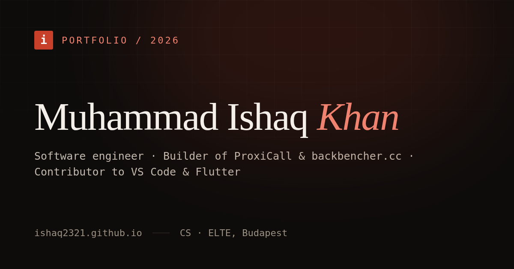

# Developer Portfolio

A fast, config-driven developer portfolio built with **Next.js 16**, **Tailwind CSS v4**, and **TypeScript**, statically exported to GitHub Pages. Editorial "engineered monograph" design with a distinctive serif/mono/sans type system, dual light/dark themes, and scroll-triggered motion.

**Live:** [ishaq2321.github.io](https://ishaq2321.github.io)



---

## Highlights

- **Single source of truth** — nearly all content lives in `portfolio.config.json`. No component edits needed to update your info.
- **Static export** — ships as plain HTML/CSS/JS to GitHub Pages (or any static host). No server required.
- **Build-time data** — GitHub stats, npm download counts, the OG social image, and your PDF résumé are all generated during `prebuild`.
- **Accessible** — respects `prefers-reduced-motion`, visible focus rings, skip-to-content link, ARIA-annotated navigation, WCAG AA contrast in both themes.
- **SEO-ready** — rich metadata, JSON-LD `Person` schema, sitemap, robots, and an auto-generated Open Graph image.
- **Dual theme** — CSS-variable-driven light/dark with a flash-prevention script and persisted preference.

---

## Tech Stack

| Layer      | Choice                              |
|------------|-------------------------------------|
| Framework  | Next.js 16 (App Router, static export) |
| Styling    | Tailwind CSS v4 + CSS variables     |
| Motion     | Framer Motion                       |
| Type       | Fraunces (display), Hanken Grotesk (body), JetBrains Mono (mono) |
| Language   | TypeScript                          |
| PDF / OG   | Puppeteer (build-time generation)   |
| Hosting    | GitHub Pages via GitHub Actions     |

---

## Quick Start

```bash
npm install
npm run dev        # http://localhost:3000
```

```bash
npm run build      # static export to out/
npm run preview    # serve the exported out/ locally
npm run lint       # ESLint
npm run typecheck  # tsc --noEmit
```

---

## Make It Yours

This portfolio is designed to be forked and reused. Most changes require editing **one file**.

### 1. Content — `portfolio.config.json`

| Key | What it controls |
|-----|------------------|
| `name`, `tagline`, `about` | Hero + About section |
| `location`, `email`, `emails`, `contactCategories` | Contact section |
| `social` | GitHub / LinkedIn links |
| `skills` | Toolkit section (languages, frameworks, AI/ML, security, platforms, tools) |
| `projects` | Project cards (see fields below) |
| `notable_contributions` | Open-source PR cards |
| `experience` | Experience timeline |
| `education` | Education section (university, thesis, high school, achievements) |
| `goatcounter` | GoatCounter analytics code (optional; leave `""` to disable) |
| `portrait` | Animated SVG portrait (optional). See below |

**Project fields:** `name`, `url`, `description`, `stack[]` are required. Optional: `live`, `benchmarkUrl`, `docsUrl`, `npm`, `pypi`, `highlights[]`, `featured`.

### Animated portrait

When `portrait.enabled` is `true`, the hero renders a hand-coded animated SVG portrait (blinking, breathing, cursor-following eyes, theme-aware) instead of `photo`. Every visual feature is a config value, so you can tune it to approximate you without touching any component:

```json
"portrait": {
  "enabled": true,
  "skin": "#c9906b",       "skinShadow": "#a9704c", "skinLight": "#d8a37e",
  "hair": "#17110c",       "hairStyle": "fringe",   // or "slicked"
  "beard": "#1d150e",      "eyes": "#33231a",
  "mole": true,            // beauty mark below the left eye
  "outfit": "#26304a",     "outfitShadow": "#1d2538",
  "lips": "#b06a55"
}
```

Set `enabled: false` (or delete the block) to fall back to a static `photo` image — the classic fork path. Animations respect `prefers-reduced-motion`.

### 2. Books — `lib/books.ts`

An optional "Bookshelf" section. Each entry is `{ title, author, isbn? }`. Covers are fetched from Open Library by ISBN with a text fallback.

### 3. Skill icons — `lib/iconMap.ts`

Maps a skill name to a [Simple Icons](https://simpleicons.org) slug. Unmapped skills render a neutral dot. Add entries to give a skill its brand icon.

### 4. Theme & design — `app/globals.css`

All colors are CSS variables under `:root` (dark) and `html.light` (light). Change the accent by editing `--accent` / `--accent-text` in both blocks. Fonts are wired in `app/layout.tsx`.

### 5. Assets — `public/`

Replace `photo.svg` with your portrait, and drop in `resume.pdf` (or let the generator build one). `og.png` is generated automatically.

---

## Build-Time Generation

The `prebuild` script runs automatically before every build:

```
fetch-github-stats.mjs  → public/github-stats.json   (repos, stars, followers, merged PRs)
fetch-npm-stats.mjs     → public/npm-stats.json       (weekly + total downloads per package)
generate-og.mjs         → public/og.png               (1200×630 social share card)
generate-resume.mjs     → public/resume.pdf           (one-page PDF résumé from config)
```

To refresh GitHub stats without hitting rate limits, set a `GITHUB_TOKEN` environment variable before building.

---

## Project Structure

```
app/
  components/        UI components (Hero, About, Projects, Skills, …)
  globals.css        Design system: theme tokens, component utilities
  layout.tsx         Metadata, fonts, JSON-LD, theme script
  page.tsx           Section composition
  opengraph-image…   (generated) — see scripts/generate-og.mjs
  robots.ts          robots.txt
  sitemap.ts         sitemap.xml
lib/
  config.ts          Typed loader for portfolio.config.json
  books.ts           Bookshelf data
  iconMap.ts         Skill → Simple Icons slug map
scripts/             Build-time generators (stats, OG, résumé)
public/              Static assets + generated JSON/PDF/PNG
portfolio.config.json  ← your content lives here
```

---

## Deployment

Pushing to `main` triggers the GitHub Actions workflow (`.github/workflows/deploy.yml`):

1. Type-check and lint
2. `npm run build` (runs `prebuild` generators, then static export)
3. Deploy `out/` to GitHub Pages

To deploy elsewhere, run `npm run build` and serve the `out/` directory on any static host.

---

## License

Released under the MIT License. Attribution appreciated but not required — fork it and make it yours.
